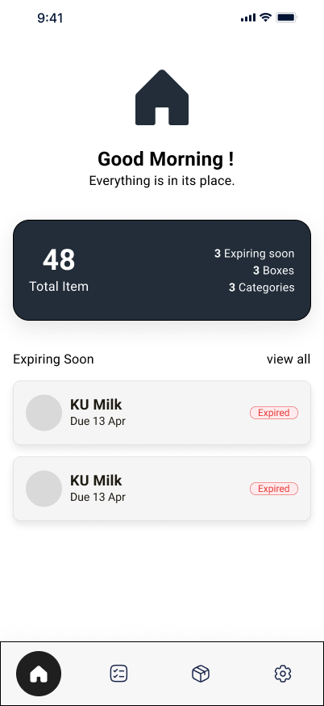
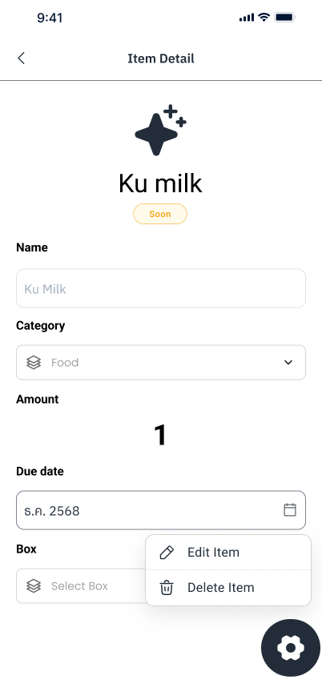
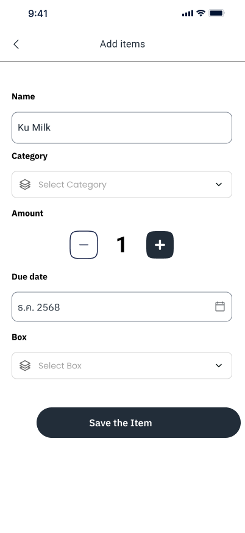

# 📦 Nestory

**Nestory** is a personal home inventory Android application designed to help you manage your household items efficiently. Built with modern Android development tools and Jetpack Compose.

## 🚀 The Problem

Ever bought something at the store, only to get home and realize you already had it? Or found an expired product buried in the back of the cabinet? Nestory was built to solve exactly that — helping you keep track of what you have at home so you never forget, overbuy, or let things expire.

## ✨ Features

- **Item Management** — Track each item with name, quantity, and expiry date.
- **Smart Grouping** — Organize items into boxes or groups (e.g., kitchen cabinet, bathroom shelf).
- **Category Tagging** — Classify items by type such as food, medicine, or household supplies.
- **Expiry Notifications** — Get notified before items are about to expire.
- **Search & Filter** — Quickly find what you're looking for.

## 📱 UI Previews

| Main Screen | Item Details | Add New Item |
|:---:|:---:|:---:|
|  |  |  |

> **Note:** To display the images, please create a folder named `screenshots` at the root of the project and add your images as `main_screen.png`, `detail_screen.png`, and `add_screen.png`.

## 🛠 Tech Stack

- **UI** — [Jetpack Compose](https://developer.android.com/jetpack/compose)
- **Architecture** — MVVM + Repository Pattern
- **Local Database** — [Room](https://developer.android.com/training/data-storage/room)
- **Dependency Injection** — [Koin](https://insert-koin.io/)
- **Background Tasks** — [WorkManager](https://developer.android.com/topic/libraries/architecture/workmanager)
- **Language** — [Kotlin](https://kotlinlang.org/)

## 🏗 Architecture

The project follows **Clean Architecture** principles, separated into layers:

- `data/` — Room entities, DAOs, and Repository implementations.
- `domain/` — Domain models and Repository interfaces.
- `presentation/` — ViewModels and Compose screens (State management).

## 🚧 Project Status

This project is currently **under active development**.
